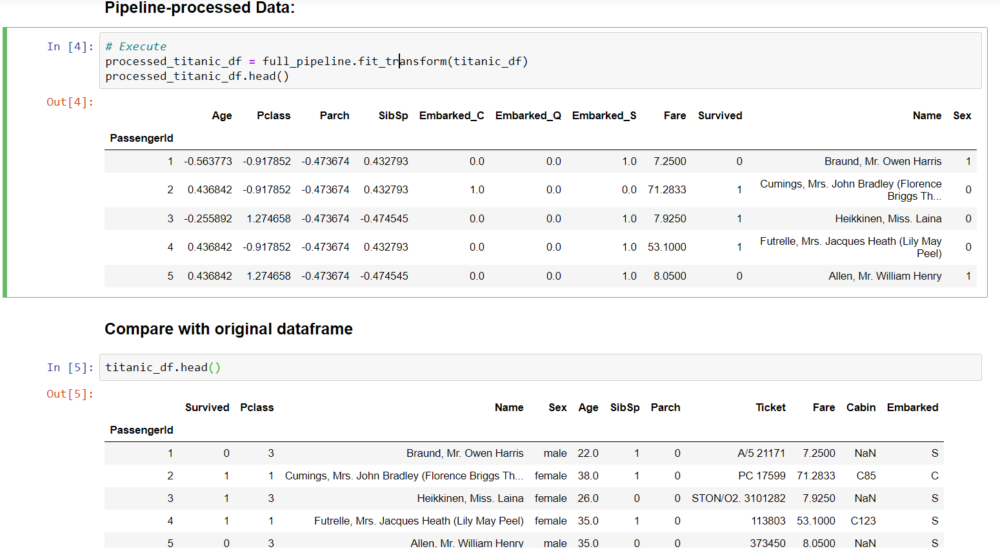

# Bamboo Pipeline
***
## Contents

- [Purpose](#purpose)
- [Setup](#setup)
- [Development](#development)
- [Examples](#examples)
- [Authors](#authors)

## Purpose
***
### Create scikit-learn data preprocessing pipelines that process/return pandas DataFrame objects

This library contains preprocessing transformer functions (inheriting sklearn.base.TransformerMixin) for Pandas DataFrames based around the concept of using PandasFeatureUnion to stitch together the results of multiple different Pipelines.   

### Motivation

The ability to return pandas DataFrames from the pipelined transformer functions instead of the (scipy.sparse_matrix, np.array, etc) native output of sklearn transformers so that the indexes and column names are preserved for the output.  This saves time/code appropriately labelling the columns and rows of the ensuing output.  The key to this module is the PandasFeatureUnion, which ties multiple pipelines together.  For instance, you can create a numeric pipeline that receives normalization operations, a categorical pipeline that receives one-hot encoding, and an identity pipeline to pass the label category through untouched. 

## Setup
***
### Requirements

This code has been developed using python 3.8, though I imagine python 3.7 and 3.6 should work as well.

### Environment

You can use `environment.yml` to create a new anaconda environment.

### Installation

`pip install .`

## Development
***
### [Contributing](CONTRIBUTING.md)

### Creating Transformers

In order for the transformer functions to work with the new PandasFeatureUnion class, we have to make sure the sklearn transformer functions return Pandas DataFrames.  For some of these, we had to create classes that inherit those duck-typed transformers.  PandasOneHotEncoder() mimics OneHotEncoder, creating intuitive column headers based on the values for which they transform.  PandasLabelEncoder() can take an entire DataFrame (or subset of it), rather than LabelEncoder's ability to only take one 2-D column of information.  Other transformer functions can be passed to PandasTransform, such as MinMaxScaler, SimpleImputer, StandardScaler, etc.  You can also pass lambda functions into the pipeline.  

For some scikit-learn transformers, you may be able to simply pass the transformer to the wrapper class PandasTransform such as:  

> PandasTransform( sklearn.preprocessing.StandardScaler() )

In other instances, you might want to use a function that is not currently a sklearn transformer:

> PandasTransform(lambda X: X.where(X.index!='Pclass',1) if X['Age']<25 else X, axis=1)

If more than a simple lambda function is required, see `transformers.py` for examples, and ensure you inherit from TransformerMixin and BaseEstimator.  You will need to implement the fit() and transform() methods.

### PandasTransform - Accepts Lambda Functions and Sklearn Transformers

PandasTransform has been designed so that it can take either sklearn.base.TransformerMixin modules or lambda functions, giving it a wide range of functionality.  if a lambda function is passed, it will utilize DataFrame.apply() with the appropriate axis passed as a parameter.  This gives the capability to perform transformations in one column that are contingent upon another column.  

Lambda Function Examples:

* Change Pclass to 1 for every passenger (row) who is under the age of 25:
 PandasTransform(lambda X: X.where(X.index!='Pclass',1) if X['Age']<25 else X, axis=1)
* Impute the maximum value of a column, since SimpleImputer does not provide 'maximum' as a strategy:
 PandasTransform(lambda X: X.where(pd.notnull(X),X.max()))
* Map specific values to numbers:
 mapping = {"ZERO": 0, "ONE": 1, "TWO": 2, "THREE": 3, "FOUR": 4, "FIVE": 5}
 PandasTransform( lambda X: mapping[X[0].upper()], axis=1)

Sklearn Function Examples:

* PandasTransform( SimpleImputer(strategy='most_frequent') )
* PandasTransform( sklearn.preprocessing.StandardScaler() )

## Examples
***

I have a [walkthrough (examples.ipynb)](examples.ipynb) notebook in this repository that you can view in order to see how it all works together.  I have worked through two examples in the notebook, the cononical Titanic dataset, and a Lung Cancer dataset.

## Authors
***
* **Dan McGonigle** [dpmcgonigle](https://github.com/dpmcgonigle)
* Credit to https://github.com/marrrcin/pandas-feature-union
    https://zablo.net/blog/post/pandas-dataframe-in-scikit-learn-feature-union
